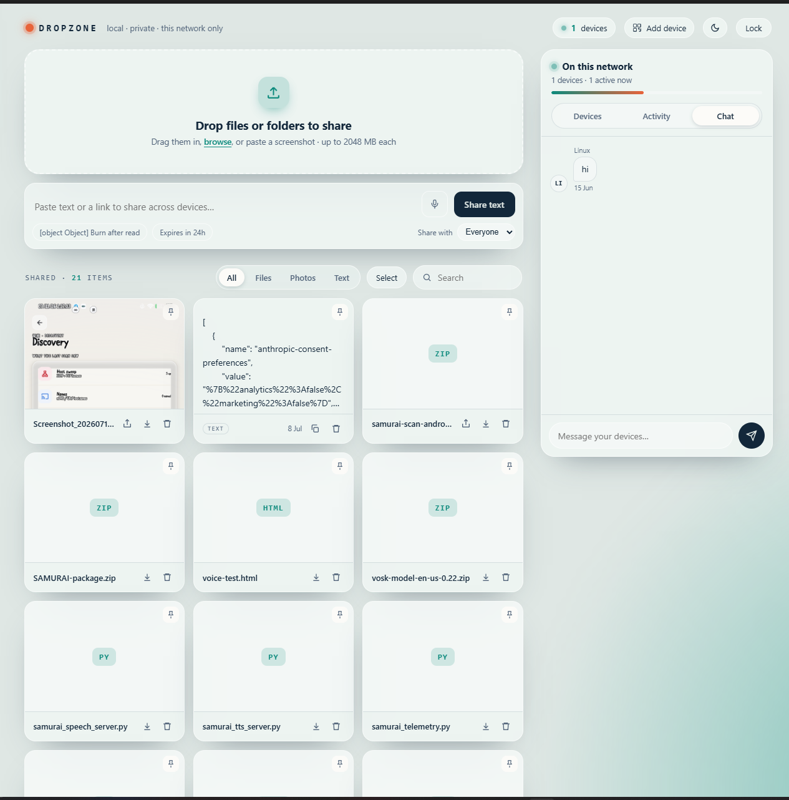
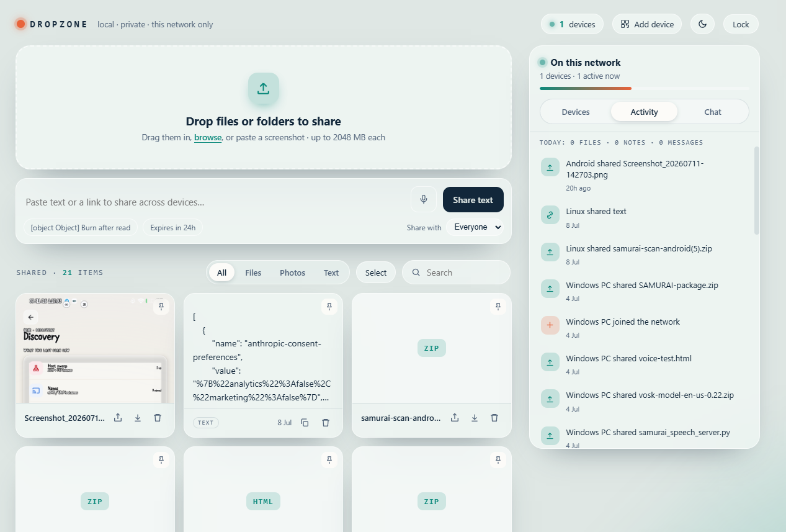
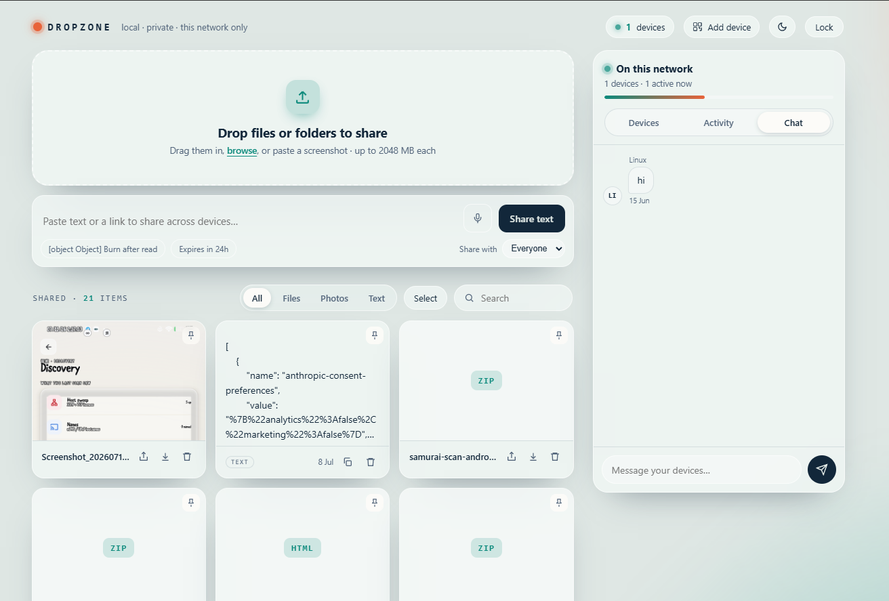

<div align="center">

# ◇ Dropzone

**Your own private AirDrop, for every device you own.**

Drop a file. Paste some text. Watch it appear on your phone, your laptop, your tablet — instantly.
No cloud. No account. No app to install. Just a browser and your home Wi-Fi.

*A self-hosted, cross-platform file-sharing app for your local network — a privacy-first, open-source alternative to AirDrop, Nearby Share, Snapdrop, and LocalSend. Runs on any Linux box, Raspberry Pi, or home server.*

[](LICENSE)
[](https://www.python.org/)
[](https://flask.palletsprojects.com/)
[](#tech-stack)
[](#why-dropzone)

</div>

---

## Screenshots

<div align="center">

<table>
<tr>
<td width="33%" align="center"><br><sub><b>The drop zone</b><br>shared files, photos & text</sub></td>
<td width="33%" align="center"><br><sub><b>Activity</b><br>who joined & what they shared</sub></td>
<td width="33%" align="center"><br><sub><b>Chat</b><br>group chat across devices</sub></td>
</tr>
</table>

</div>

---

## Why Dropzone

You have a laptop, a phone, maybe a tablet, and they never talk to each other. AirDrop only works between Apple devices. Google's "Nearby Share" doesn't reach your iPhone. Emailing yourself a file feels like it's 2009. Cloud drives mean waiting on an upload *and* a download, and handing your files to somebody else's server in the process.

**Dropzone fixes this by turning any always-on computer on your network into a shared drop point.** Open a page in your browser — any browser, any device — and everything you share appears everywhere else, in real time. It never leaves your home network unless you want it to.

It was built from scratch, iteration by iteration, into a genuinely full-featured home hub — including, yes, a real remote desktop viewer for the machine it runs on.

---

## Features

### 📥 Share anything, instantly
- **Drag-and-drop** file uploads — including whole **folders** — with a live progress ring
- **Paste-to-upload**: copy a screenshot anywhere, paste it on the page, done
- **Voice memos** recorded straight from the browser mic
- **Upload from a URL** — paste a link and the *server* downloads it, so a 2GB file downloads once on your laptop instead of draining your phone's battery and data
- Text and clipboard sharing, with one-tap copy on any device

### 🔒 Share smart, not just wide
- **Burn-after-read notes** — a secret (like a Wi-Fi password) that deletes itself the instant someone opens it
- **Per-item expiry** — a note or file that vanishes after a set time, independent of global settings
- **Send to one device** — target a specific device instead of broadcasting to everyone on the network; the recipient sees a "for you" badge and no one else sees it at all
- **Per-item share links** — copy a direct link to any file and hand it to someone without exposing the whole drop zone

### 🗂️ Actually stay organized
- **Pin** important items to the top of the feed
- **Labels/tags** with one-click filter chips — turn a flat pile of files into lightly organized storage
- **Multi-select** with **bulk delete** and **download-selected-as-a-zip**
- **In-page previews** for images, video (seekable), audio, PDFs, and text files — no download required
- A **storage panel** showing your largest files and one-tap cleanup ("older than 30 days," "everything unpinned")

### 🖥️ It's a home hub, not just a folder
- **Live device list** — every phone, laptop, and tablet that opens the page shows up automatically, with type detection and renaming
- **Activity feed** — a shared, chronological log of who shared what, with a one-glance daily digest
- **Cross-device chat** — a lightweight group chat baked right in
- **Remote screen viewer** — a real VNC connection (see and control the host laptop's desktop) from any browser, anywhere in the house
- **Tailscale-aware**: automatically detects remote access and switches to a lighter, mobile-data-friendly view

### ⚡ Feels instant
- Real-time push updates via **Server-Sent Events** — no waiting on a refresh, no polling lag
- A QR code to onboard a new device in one scan
- Light and dark themes, fully responsive from phone to ultrawide

### 🔐 Private by design
- 100% self-hosted — your data never touches a third-party server
- Optional shared **PIN** to lock the whole drop zone
- Runs entirely on your LAN; pair with [Tailscale](https://tailscale.com) if you ever want secure access from outside home

---

## Quick start

Dropzone runs on any always-on Linux machine — an old laptop, a Raspberry Pi, a home server.

```bash
git clone https://github.com/sxi9/dropzone.git
cd dropzone

python3 -m venv venv
source venv/bin/activate
pip install -r requirements.txt

python app.py
```

You'll see:

```
Dropzone running on http://0.0.0.0:8000  (PIN off, expiry off day(s))
```

Find your machine's address with `hostname -I`, then open `http://<that-address>:8000` from **any device on the same Wi-Fi** — phone, laptop, tablet, doesn't matter. Tap **Add device** on the page for a QR code that makes onboarding the rest of your devices a five-second job.

### Running it 24/7

A one-time systemd setup keeps Dropzone alive in the background, restarting automatically on crash or reboot:

```bash
nano dropzone.service        # set your username and paths
sudo cp dropzone.service /etc/systemd/system/dropzone.service
sudo systemctl daemon-reload
sudo systemctl enable --now dropzone
```

---

## Configuration

Every setting is an environment variable — no config files to hand-edit.

| Variable | Default | Description |
|---|---|---|
| `DROPZONE_PORT` | `8000` | Port the app listens on |
| `DROPZONE_PIN` | *(none)* | Optional shared PIN to lock the drop zone |
| `DROPZONE_MAX_MB` | `2048` | Maximum upload size per file, in MB |
| `DROPZONE_EXPIRE_DAYS` | `0` (never) | Auto-delete items older than N days |
| `DROPZONE_DATA` | `./data` | Where uploaded files and the database live |
| `DROPZONE_VNC_PORT` | `5900` | Local port the screen server listens on |
| `DROPZONE_WS_PORT` | `6080` | Port the browser connects to for the screen viewer |

Set them in `dropzone.service` under `[Service]`:

```ini
Environment=DROPZONE_PIN=4729
Environment=DROPZONE_EXPIRE_DAYS=30
```

---

## Remote screen viewer (optional)

Dropzone can show and control the host machine's actual desktop from any browser on your network — a real VNC session, streamed through the app itself.

One-time setup on the host:

```bash
sudo apt install x11vnc
sudo cp x11vnc.service /etc/systemd/system/
sudo systemctl enable --now x11vnc
```

Open the **Screen** tab in the sidebar — once the status dot turns green, tap **Open live screen**. Mouse, keyboard, and a Ctrl-Alt-Del button all work from your phone.

> **Security note:** x11vnc is configured with `-localhost`, so the raw VNC port is never exposed to your network directly — only Dropzone's own bridge can reach it. Anyone who can already open your Dropzone page can use the screen viewer, so set a `DROPZONE_PIN` if that matters to you.

---

## Architecture

Dropzone is deliberately low on moving parts — no build step, no framework lock-in, nothing to compile.

```
┌──────────────────────┐      HTTP / SSE       ┌─────────────────────────┐
│   Any browser (any    │ ◄───────────────────► │   Flask backend          │
│   phone/laptop/tablet)│                       │   + SQLite               │
└──────────────────────┘                        └─────────────────────────┘
                                                          │
                                                 WebSocket │ bridge
                                                          ▼
                                                 ┌──────────────────┐
                                                 │  x11vnc (screen)  │
                                                 └──────────────────┘
```

- **Backend** — a single-file Flask app (`app.py`) with a SQLite database. No ORM, no migrations framework — just plain SQL and a small in-process auto-migration on startup.
- **Frontend** — a hand-rolled ~120-line template interpreter (think a tiny, purpose-built alternative to React) that renders the UI from live JSON state. No build tooling, no `node_modules` to ship, no framework version to keep patched.
- **Real-time sync** — Server-Sent Events push changes to every open device the moment they happen, with a slow poll as a safety net.
- **Screen sharing** — a vendored copy of [noVNC](https://novnc.com/) talks to `x11vnc` through a WebSocket bridge that Dropzone runs itself.

## Tech stack

| Layer | Choice | Why |
|---|---|---|
| Backend | **Flask** | Minimal, dependency-light, trivial to run as a systemd service |
| Database | **SQLite** | Zero-config, file-based, plenty fast for a household |
| Frontend | **Vanilla JS** | No framework to update, no build step, works forever |
| Real-time | **Server-Sent Events** | Simpler and more robust than WebSockets for one-way push |
| Screen share | **x11vnc + noVNC** | The proven, standards-based way to VNC in a browser |
| Process management | **systemd** | Native to any Linux box, restarts on crash and boot |

---

## Roadmap

- [ ] Token-gated screen viewer (separate from the main PIN)
- [ ] True folder browsing, not just labels
- [ ] Native background photo backup (would need a companion mobile app)
- [ ] Multi-user accounts with per-user visibility

Have an idea? Open an issue — this project grows from exactly that kind of feedback.

---

---

## Repository contents

| File | Purpose |
|---|---|
| `app.py` | The entire backend — routes, database, VNC bridge |
| `templates/index.html` | The full UI: styles, markup, and frontend logic |
| `templates/login.html` | PIN entry screen |
| `templates/screen.html` | Full-page remote screen viewer |
| `static/novnc/` | Vendored noVNC client (screen viewer dependency) |
| `dropzone.service` | systemd unit to run Dropzone 24/7 |
| `x11vnc.service` | systemd unit to run the optional screen server 24/7 |
| `.env.example` | Every configuration variable, documented |
| `CHANGELOG.md` | Version history from MVP to the current release |
| `CONTRIBUTING.md` | How to set up, structure, and submit changes |

---

## Contributing

Pull requests are welcome. See **[CONTRIBUTING.md](CONTRIBUTING.md)** for the full workflow, project structure, and coding conventions. Short version:

1. Fork the repo
2. Create your feature branch (`git checkout -b feature/amazing-thing`)
3. Commit your changes
4. Push and open a PR

---

## License

Released under the [MIT License](LICENSE) — do whatever you'd like with it.

---

<div align="center">

**Built for the simple idea that your own devices should talk to each other without a middleman.**

If Dropzone saved you a USB cable or an "email it to myself," consider starring the repo ⭐

</div>
